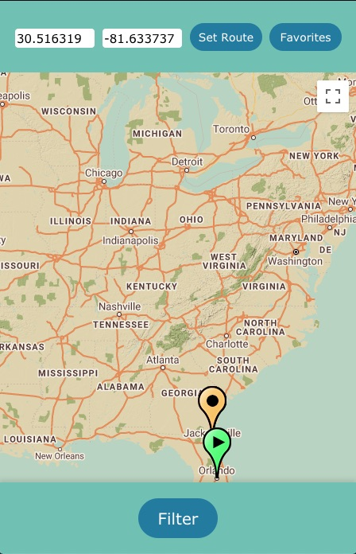
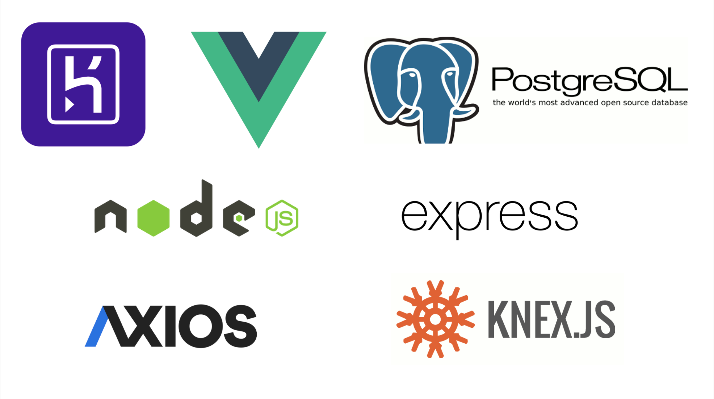

# The Truck Stop Life

**このリポジトリは [Code Chrysalis](https://www.codechrysalis.io/)の生徒であるときに作成しました。**

**This was created during our time as students at [Code Chrysalis](https://www.codechrysalis.io/).**

## 概要/About This App

"The Truck Stop Life"を使えばあなたのアメリカの旅が快適になること間違いなし！近くのトラックストップを特定の設備(ATM やレストラン、などなど！)でフィルターすることができます。🚛

"The Truck Stop Life" can help users find nearby truck stops as they're traveling across the US. They are able to filter locations that have specific amenities, such as ATMs, restaurants, and more! 🚚

App demo: https://the-truck-stop-life.herokuapp.com

## App の使い方

1. アプリを開くと、全てのトラックストップを見ることができます。
2. Filter ボタンを押すと設備ごとのフィルターをかける事ができます。
3. マップにあるマーカーをクリックする事でその場所をお気に入りに登録することができ、Favoriteボタンを押すことで全てのお気に入りだけを見ることができます。

## Getting Started

1. You can see all nearby truck stops when you open the app.  
2. You can filter truck stop amenities by pushing the filter button and toggling your selections on or off.
3. You can save your favorite locations by tapping on markers, and view them by pushing the "Favorites" button.

## 使用した技術/Technologies Used:

##作成したメンバー/member who made this app
-Naoto Maeda (https://github.com/naoto-1119)
-LaShawn Toyoda (https://github.com/theyokohamalife)
-Yosuke Mikasa (https://github.com/suke6mix)
-Ryusei Takezono (https://github.com/ryu-take)
