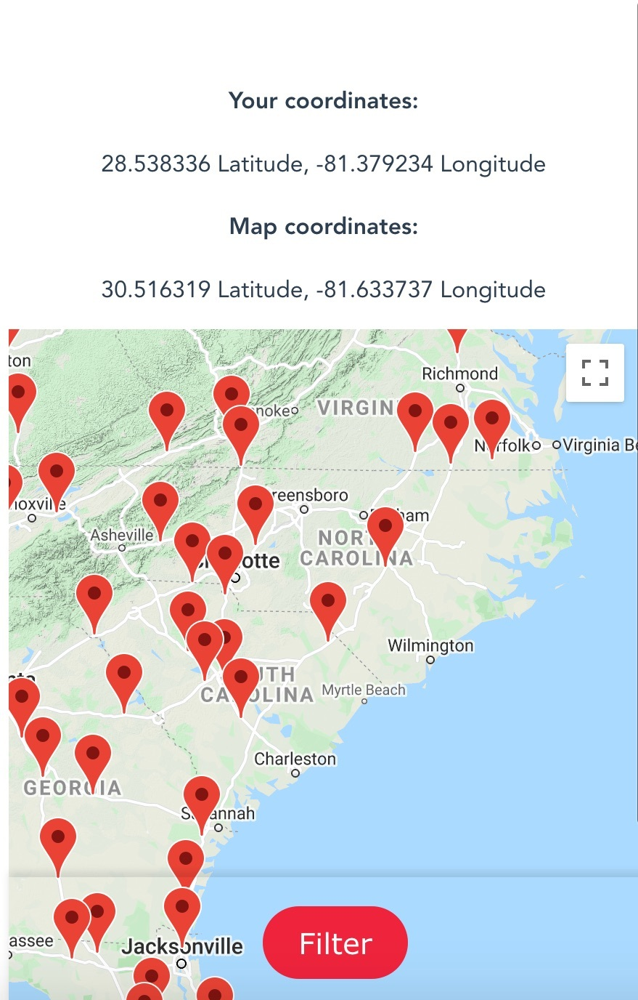

# The Truck Stop Life

**このリポジトリは [Code Chrysalis](https://www.codechrysalis.io/)の生徒であるときに作成しました。**
 

**This was created during our time as students at [Code Chrysalis](https://www.codechrysalis.io/)**
cc16 + ccj3 first team project

<!-- ATM, Showers, Overnight Parking, Wifi, McDonald's, Subway, Denny's, Baskin Robbins -->

## 概要/About This App

"The Truck Stop Life"を使えばあなたのアメリカの旅が快適になること間違いなし！近くのトラックストップを特定の設備(ATM やレストラン、などなど！)でフィルターすることができます。🚛

"The Truck Stop Life" can help users find nearby truck stops as they're traveling across the US. They are able to filter locations that have specific amenities, such as ATMs, restaurants, and more! 🚚

App demo: https://the-truck-stop-life.herokuapp.com

## App の使い方

English is below!

1. アプリを開くと、全てのトラックストップを見ることができます。

2. Filter ボタンを押すと設備ごとのフィルターをかける事ができます。

3.

## Getting Started

1. You can see all nearby truck stops when you open the app.  
   
2. You can filter truck stop amenities by pushing the filter button and toggling your selections on or off.

3.

## 使用した技術/Technologies Used:

